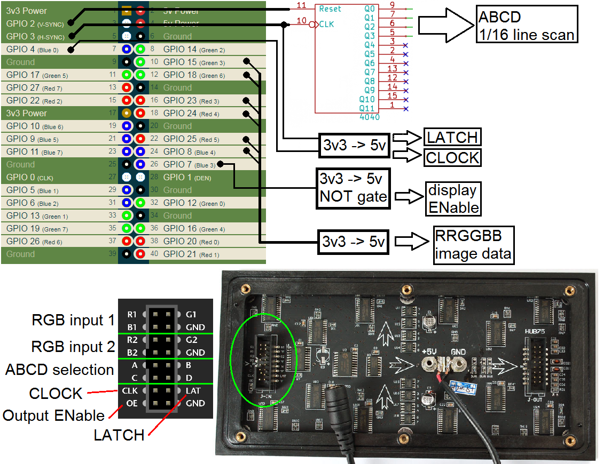
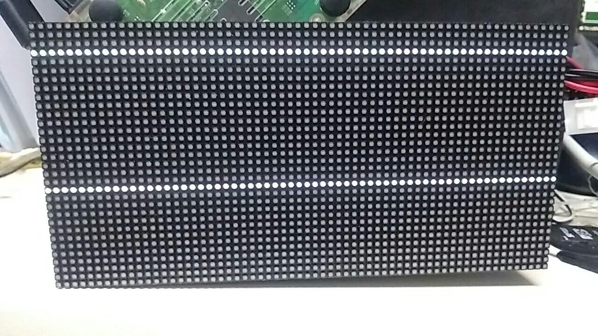
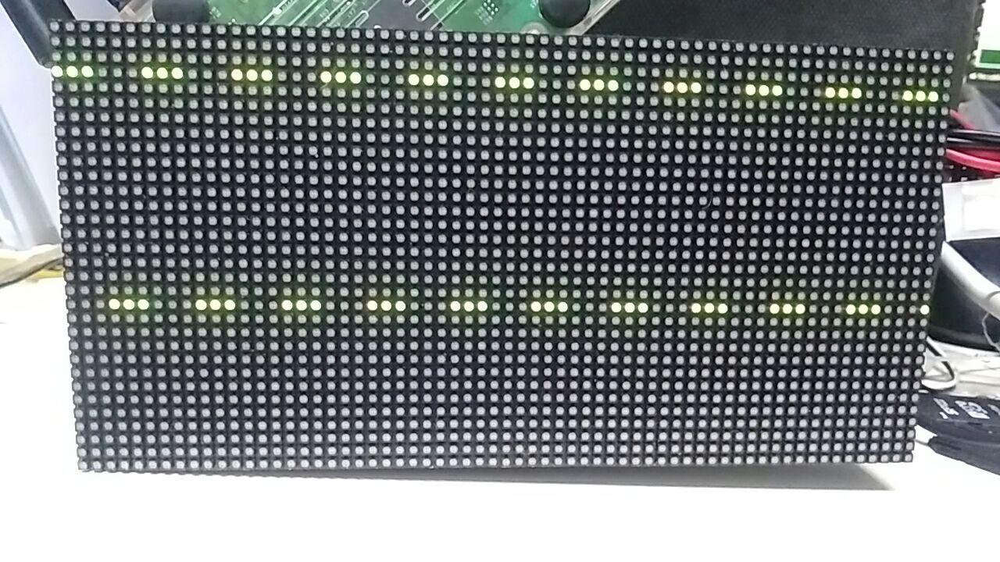
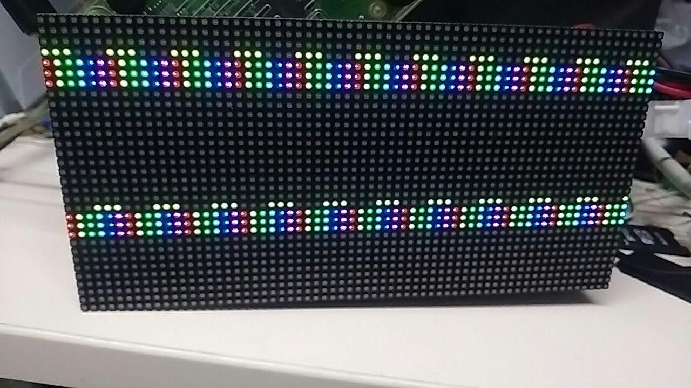
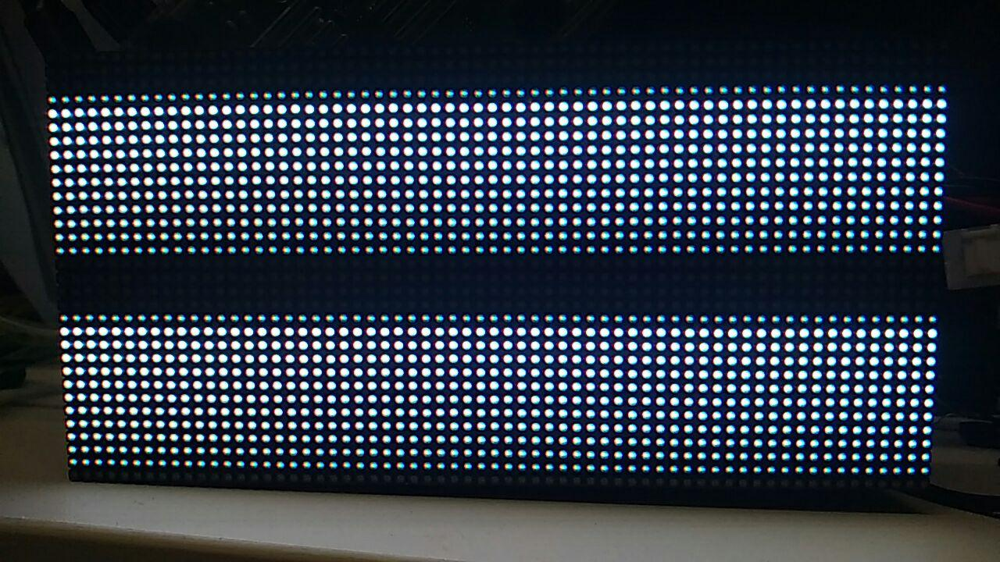
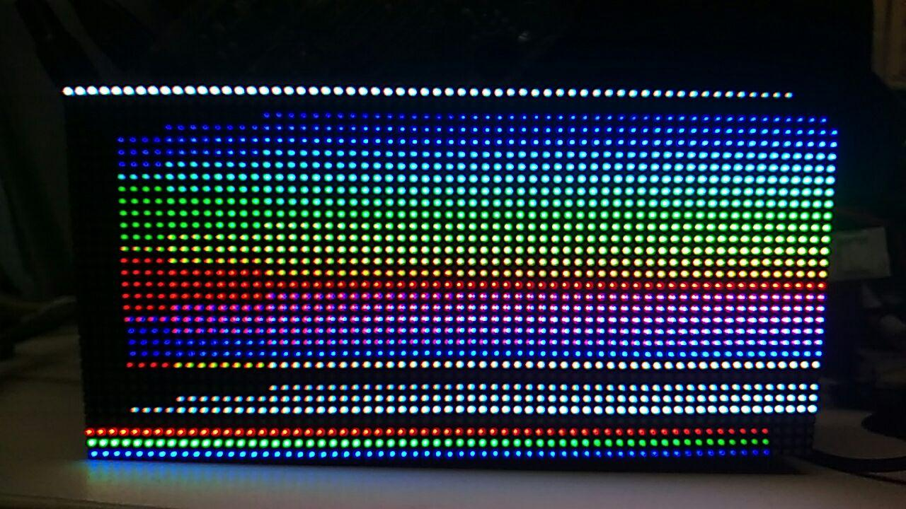
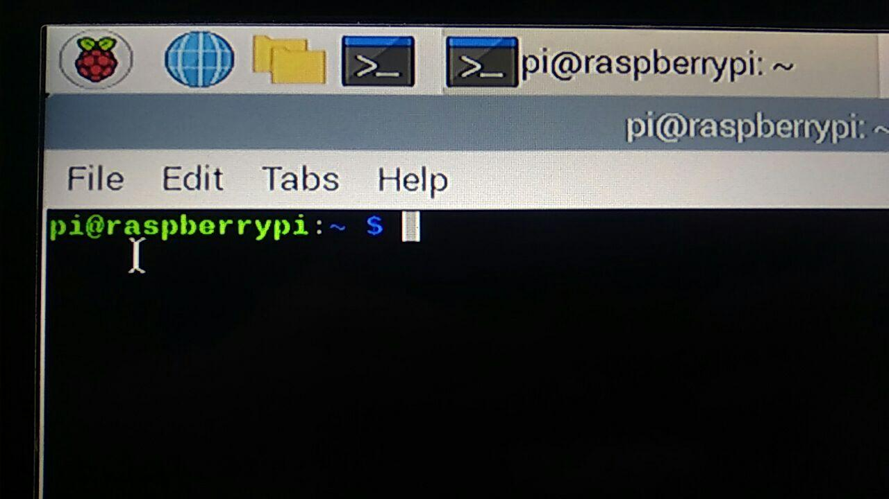
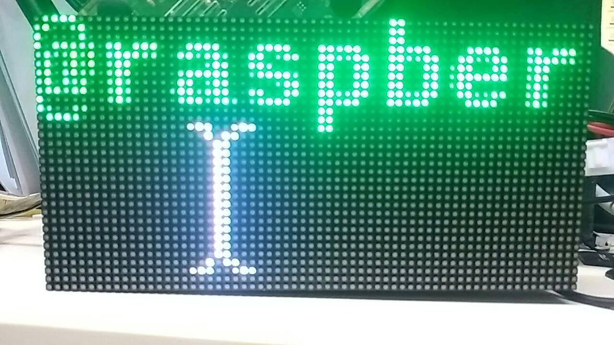
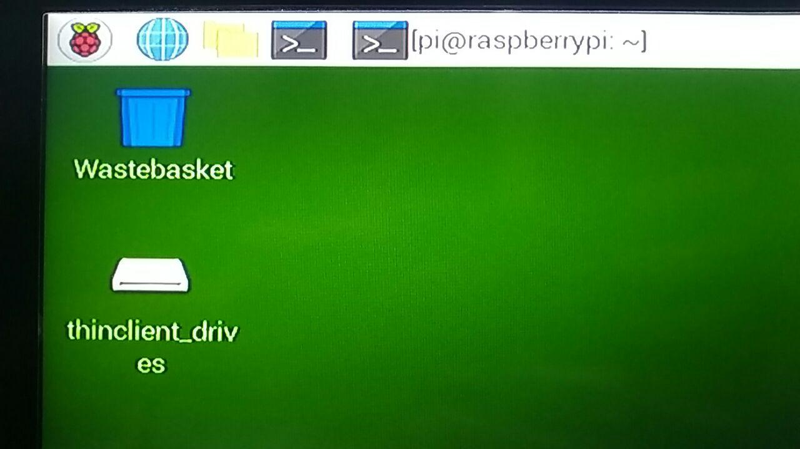
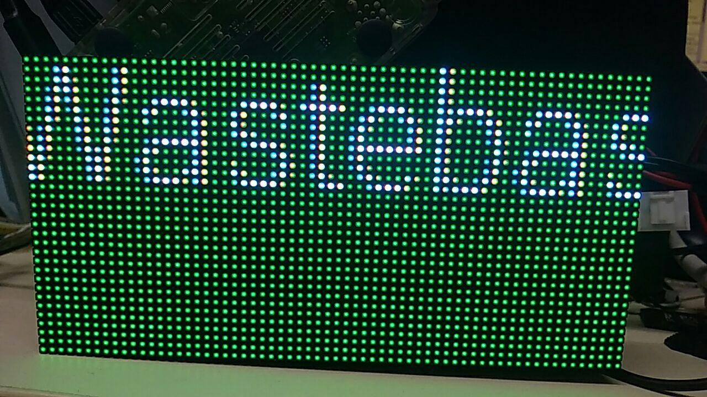

# PoC-rPi-LED-matrix
Look mum I can have high speed DMA on rPi. // This is improvement (prof of concept) to [hzeller][url]'s code. My method uses different hardware to reduce CPU load. 


What is the LED matrix? 
-
- Really stupid piece of display. Basically no internal memory. 
- Requires constant refreshing. Almost like CRT monitor. 
- Binary color (on or off). Software-based dimming. 
- A lot of input lines. Hard to drive with uC (easy for FPGA). 

What is the [DPI interface][DPI] found in rPi boards? 
-
- Basically a VGA port without analog part. 
- Bare video output with 24 bit color depth, separate synchronization lines and even pixel clock. 
- No analog part. 24 bits color depth equals to 24 digital output lines. One line per bit. 8 lines (bits) per color. 
- Great for driving old LCD panels (ones with TTL input). Not compatible with modern panels (ones with LVDS input od display port). 
- Output resolution up to 1920x1080 (HD) @ 60hz. Pixel clock can be set to any value, up to 120Mhz. 
- Fast and reliable. DMA-like transfers from system RAM to output (GPIO pins) have priority over CPU issued data transfers. Basically if system run out of RAM bandwidth, DPI interface will work (refreshing VGA CRT monitor) and CPU will wait. 
- Important note, DPI interface IS ILLEGAL. High speed digital signals will cause some radio signal emission, interference, and similar problems. You need certification to produce and sell electronic devices but DPI interface without shielding wouldn't pass the test. Not a problem for hobbyists, huge deal for real business. Play at your own risk or ask local amateur radio operators for advice. 

How to drive LED matrix? 
-
- Send image to the panel, one line at the time, no PWM / brightness control, only on/off for each sub-pixel. 
- Select active line, store the data, enable output drivers (shine the LEDs). Wait certain amount of time. Preload next line while counting time. 
- Repeat through all display lines. 
- Do the soft PWM. Redraw whole screen again. This time shine the LEDs for half of the time and different set of data. This is called bit planes. 
- Done. Single frame displayed. Now draw second frame and another and another... Basically keep refreshing the screen. 

Available solutions for driving the matrix? 
-
- FPGA based driver. Buy it ([example 1][fp1]) or cook your own solution using FPGA ([example 2][fp2]), ([example 3][fp3]), ([example 4][fp4]). 
- SPI interface. Display takes serial data input, right? Wrong. Display takes 6 lanes of serial data. 3 lines (one per color - RGB) for upper half of the matrix and second set for lower half. All 6 SPI lines can be daisy chained in small display setup but that generates wiring problems and slows down the refresh rate. [Example 1][ex1], [example 2][ex2]. DMA controller and high speed SPI transmitter (SPI master) is mandatory. 
- Calculate all signals on CPU and bit-bang them to GPIO pins. This approach gives the best flexibility, but comes at a cost of high CPU usage. CPU have to keep perfect timing to achieve the effect. Doable ([example][url]) but not recommended on single CPU system like rPi zero. 
- Bit-bang approach with DMA? Here comes this project. Platform like rPi have very slow DMA controller (hzeller reported about 2Mhz output speed, way below 30Mhz display limit). However DPI interface don't have such speed limit. Just enable it and give it a try. 


[url]: https://github.com/hzeller/rpi-rgb-led-matrix
[DPI]: https://pinout.xyz/pinout/dpi
[fp1]: https://www.adafruit.com/product/1453
[fp2]: https://www.youtube.com/watch?v=Sq8SxVDO5wE
[fp3]: https://www.open-electronics.org/a-fpga-controlled-rgb-led-matrix-for-incredible-effects-the-hardware/
[fp4]: https://learn.adafruit.com/fpga-rgb-matrix?view=all
[ex1]: https://www.hackster.io/brian-lough/rgb-led-matrix-with-an-esp8266-a16fa9
[ex2]: https://github.com/GurraB/LED_display

Enabling the DPI interface. 
- 
In this setup You need 2 separate framebuffers. One for HDMI screen (just a canvas for the OS to draw on) and one for DPI interface to pull data from. Add these lines to `/boot/config.txt` or just copy-paste example config.txt and replace your existing one. 
```
# Uncomment this to enable infrared communication.
#dtoverlay=gpio-ir,gpio_pin=17
#dtoverlay=gpio-ir-tx,gpio_pin=18

#enable DPI output interface
dtoverlay=dpi24
framebuffer_priority=2
enable_dpi_lcd=1
#display_default_lcd=0

dpi_group=2
dpi_mode=87
max_framebuffers=2

dpi_output_format=0xc017
dpi_timings= 240 0 10 20 10 360 0 1 1 1 0 0 0 60 0 40000000 3
#            ^ horizontal    ^ vertical             ^ pixel clock

# Additional overlays and parameters are documented /boot/overlays/README
```
Where: 
- Horizontal resolution have to be greater than length of the string, times two. 64px wide panel need 130-140px at least. Too little might give You troubles with too high horizontal refresh rate. My panel gives up above 200hz. 
- Vertical resolution need to fit all lines we like to push in. 32px height panel requires 16 lines per bitplane (reduced brightness) and 16 misc lines on top. 
- Pixel clock - start with low value, then ramp up as high as You need. LED panel require 2 pixels for 1 clock pulse. Typical panels accepts up to 35Mhz so pixel clock can be as high as 70 millions (70000000). 

Hardware setup. 
-
- RGB LED matrix requires 3 separate inputs. 5V logic. 
  - Data input. 6 pins (2 sets of RGB) unique for each panel. 
  - Row control. 3, 4 or 5 lines, shared across all connected panels. Sometimes as simple as binary counting, sometimes have own shift register. 
  - Clock, Enable and Latch. 3 lines shared across all connected panels.
- DPI interface sends 5 signals. 3v3 logic. 
  - 24 bits as the image data. Easy to encode informations. 
  - Horizontal synch. 
  - Vertical synch. 
  - Pixel clock, always active. Basically unusable in this project. 
  - Data valid / data enable, basically a gating signal for pixel clock. 
- 
  - Voltage translators between rPi and matrix are mandatory. 
  - All data pins, clock and OE have to be attached to DPI data output (24 pins). 
  - Extra outputs on rPi DPI interface can be used (and abused) to some point but can't be reconfigured. Enable pin and horizontal synch can be used to count lines and/or latch data. Vertical synch can be used as synchronization and refresh rate indicator. Pixel clock is useless :( 
  - Pixel clock for the matrix have to stop as the latch pulse comes. This mean the clock signal have to be generated via DPI data output. Dedicated clock output can't be used. 
  - Output enable for the matrix also have to be generated, otherwise it's hard to achieve dimming. 
  - I decide to add binary counter to ease on code side. Horizontal sync triggers the latch pin and count up lines on the matrix. Lines of the matrix (counter) are synched with lines of framebuffer thanks to the reset input connected to vertical synch. 
  - All pins can be reconfigured across DPI data pins. Bare in mind GPIO 0, 1, 2, 3 have strict functions and can't be reconfigured. 

Theory of operation. 
-
- Software does NOT send any signal to the panel (via GPIO pins). 
- Software makes the data conversion from standard video buffer (width * height * RGB) to bitplanes, assembly them together, add clock and control signals, then send it all to the framebuffer. 
- Conversion is done once per frame. DPI interface will take care of refreshing LED matrix. 
- LED panel requires 2 DPI pixels per 1 LED. Both with the same data. Each with opposite state of the CLK line (software generated clock). 
- LED panel requires 2 DPI lines to drive 1 line of matrix: 
  - DPI line 1 sends data to line 1 of the panel. 
  - DPI line 2 drives the ENable pin for line 1 of the panel (brightness control). 
  - DPI line 2 sends data to line 2 of the panel. 
  - DPI line 3 sends data to line 2 of the panel. 
  - DPI lines 3 and 4 controls line 3 of the panel. 
  - ...
- 16 lines of framebuffer covers whole screen (1/16 drive). 16 lines are considered as single bitplane. 
- Next bitplane can be displayed as 16 lines with brightness reduced by half or as 32 lines (display the same content, double the brightness). 
- Framebuffer have to be big enough to fit all lines and all horizontal pixels. Otherwise software will crash. 
- It is possible to calculate framebuffer size and set it via command, but setting that in config.txt is way easier. 


Example 1. Can I have some output. `1-line.py`
-
This is the simplest test for the idea. Also a sandbox to play with. Software assembles few example lines. Your task is to push them into the framebuffer. If it works, play with it more. If it doesn't work and You changed any piece of generating code then You have to apply same changes to the next examples. 

^ Just a single line. I'm proud it's working. 


^ I can generate and display dots, dashes, anything binary (8 colors). 


^ Simple rainbow using lookup table. 


```f.write(WW_line)
for n in range (1, 12):
    for line in range(0, n):
        f.write(WW_line) 
    for line in range(n, 16):
        f.write(bright_line) 
```
^ This is how I can get gradient. Just write more lines in the same place of the screen. 
Takes 1.5 second on rPi 2 (single core load)


Example 2. Displaying test pattern. `2-rainbow.py`
-
4 bitplanes can create simple rainbow pattern. Each line have the same brightness settings. Bit 4 is repeated once, bit 5 twice, bit 6 - 4 times, bit 7 (MSB) - 8 times. There are also 13 empty lines to counteract image offset created by 4040 binary counter and the way hardware works. 


Example 3. Mirror main screen. `3-mirror-fb0.py`
-
Let's just grab a piece of image from main framebuffer (fb0), convert and throw into panel (fb1). 
This demo gives me about 0.7 FPS (1.3s) to convert 2048 pixels at 24b color depth (8b per color). 
With 12b color depth (4b per color, 4 bitplanes) speed is up to 1.4 FPS on rPi 2 (single core). 
Refresh rate of the screen is still around 400 hz for this single panel setup. Not kidding. DPI interface just spits out the bytes by itself. 

Desktop (LCD monitor)  | Piece of desktop displayed on LED matrix
-----------------------|------------------------------
        |
-----------------------|------------------------------
        |

Example 4. Gain some speed with NumPy. `4-speed.py`
-
Basically python is SLOW. Every loop cost time, every command cost time. What's the alternative? 
NumPy. Can do a lot with single python command, just faster. By rewriting code and eliminating loops i bumped the spped incrementally to 10, 25 and 40 FPS (this version is included here). Now i have usable speed to playback video (yess, screen capture from /dev/fb0) directly from 'tube. Good job rPi 2. 
BTW, please don't judge me by this code. I'm not proud of it. Just leave it as one of the steps. 

Example 5. NumPy'fy everything. `5-numpify.py` and `6-improvements.py`
-
Rewriting time again. Added scaling opion. Removed as much as possible from main loop and pre-generate as much look-up tables as possible. 100 FPS speed for worst case scenario, up to 150FPS with no scaling and reduced output scale. Now it's time to say *enough* and write documentation. 
Both 5 and 6th revision works the same. 6 just looks a bit better and some options are easier to change. 


Calculating the speed. 
- 
- Datasheet says 35Mhz max, in practice it should be around 40Mhz. I used 20Mhz and let's assume this is the best speed for the LED matrix. To achieve this, set the DPI clock to twice the speed (40Mhz or more). 
- Single matrix requires (64 lines * 2 clk * 16 lines) write cycles per bitplane. That gives 2k writes for single bitplane (64x32, 2k LEDs matrix). 
- Each bitplane need it's own unique weight (factor of 2). Image with 4bit color depth can have weights of 1, 1/2, 1/4, 1/8 (dim screen) or 8, 4, 2, 1 (repeat single bitplane without dimming, slow). First option takes 8k write cycles and refresh rate of about 5khz, second one 30k write cycles and 1khz refresh rate. 
For 8bit color the results are 2.5khz VS 78hz. So let's stick with PWM brightness control, dim screen and faster refresh rate. 
- Due to hardware limitations, there have to be extra bitplane "black" and some time is wasted on synchronization. 
- Assuming 32k pixels driven of single channel can result 40Mhz / 32k pixels / 9 bitplanes = 135hz refresh rate. Alternatively 240hz for 35Mhz panel clock (70Mhz DPI clock) and 270hz refresh rate for 40Mhz panel clock. Haven't experimented with maximum clock frequency, but DPI hardware gives a lot of fine tuning possibility. 
- BTW, please calculate length of single chain and set DPI horizontal resolution a bit longer. 

Calculating brightness. 
-
- Brightness control? Panel have to be dim during synchronization time (about 10% of time for small panel chains, closer to 5% for longer chains). 
- If brightness is controlled by time, weakest bitplane is displayed once (1) while strongest is showed many times (128 for 8b color depth). This technique steals time (slow refresh rate) but allows for full output power. 
- If brightness is controlled by PWM, strongest bitplane is displayed fully (1) while weakest is dimmed by PWM (1/128 power for 8b color depth). This technique steals brightness. Overall brightness is about 1 / color depth, like 12% of full brightness for 8b color depth. Not best, but no place to shine. 
- Compromise, show some bitplanes multiple times (weight 8, 4, 2, 1) and rest with PWM (1/2, 1/4, 1/8, 1/16). This reduces maximum brightness to about 70% and reduces refresh speed to about 40% of PWM approach. OK for me. 
- BTW, DPI vertical resolution is strictly related number of displayed bitplanes. Too much lines will result in dimmer panel and lower refresh rate. Not ideal. 

Summary. 
- 
- It works! 
- It steals all GPIO :( 
DPI24 interface sets all pins to ALT2 function at bootup. Any unused pin can be manually changed back to default function, but all GPIO will be set as output low for the bootup time. 
- Only 24 pins can be freely controlled. Remaining 4 can be used with preassigned function or not used at all. 
- Where are signals for ABCD row decoder? All comes from 4040 binary counter, driven by Hsync and Vsync. This greatly simplifies the code (and i'm too lazy to generate all that signals proper way). Feel free to fix this. 

